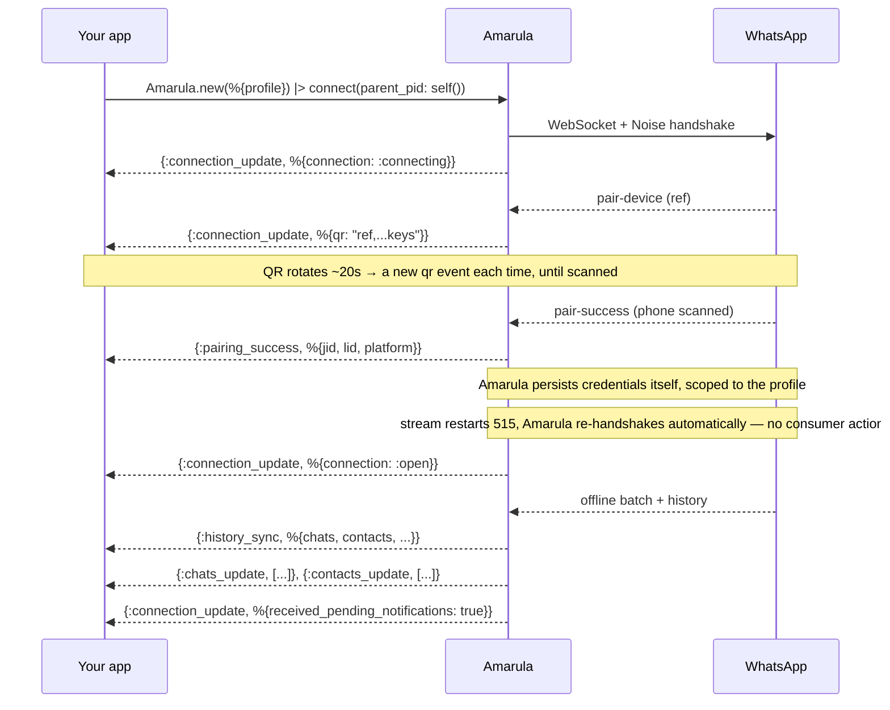
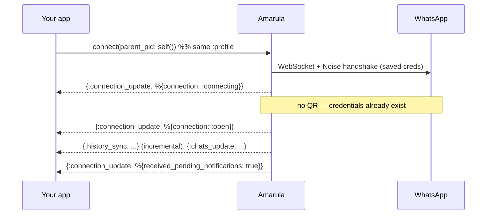
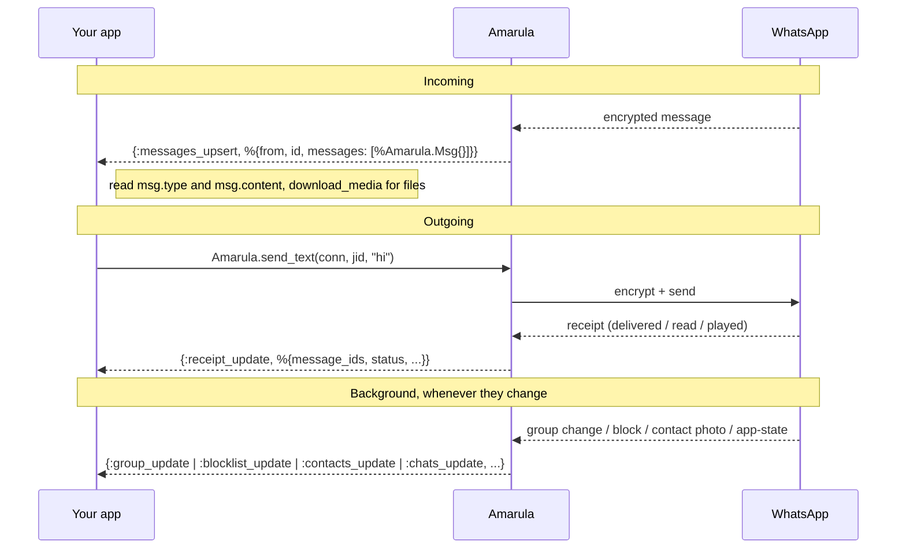
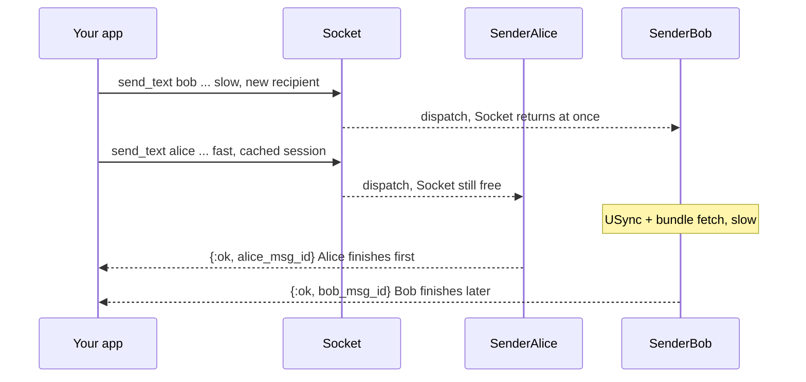

# Amarula

A **WhatsApp Web client for Elixir** — connect to WhatsApp the way the
web/desktop app does: pair once by scanning a QR code with your phone, then send
and receive messages from your own Elixir code.

Amarula is a faithful port of [Baileys](https://github.com/WhiskeySockets/Baileys)
(the TypeScript WhatsApp Web library) to idiomatic Elixir/OTP. It speaks the real
protocol end to end: the Noise handshake, the Signal Protocol for end-to-end
encryption, WhatsApp's binary message format, multi-device (LID), groups, and
history sync.

> **Note:** This is an unofficial library. It is not affiliated with or endorsed
> by WhatsApp. Use it on accounts you control and in line with WhatsApp's terms.

## Features

- QR-code pairing, with credentials persisted per **profile** (reconnect without re-pairing)
- Send/receive **text, media** (image/video/audio/document/sticker), **reactions, edits, deletes**
- **1:1 and group** messaging
- **Polls** (create + tally), **presence/typing/read** receipts, **contacts & location**
- **History sync** (your existing chats load on link)
- A **pluggable storage** backend (file or DETS out of the box) and **send/receive plugins** (Req-style)
- Many independent connections in one VM — no global state

## Install

```elixir
def deps do
  [
    {:amarula, "~> 0.1.0"}
  ]
end
```

## Quick start

```elixir
# Start a connection. Events (the QR code, incoming messages) are delivered to
# parent_pid — here, the current process.
{:ok, conn} =
  Amarula.new(%{profile: :me})
  |> Amarula.connect(parent_pid: self())

# First run: you get a QR code. Scan it on your phone:
#   WhatsApp → Settings → Linked Devices → Link a device
receive do
  {:whatsapp, :connection_update, %{qr: qr}} when is_binary(qr) ->
    IO.puts(qr)   # render this as a QR code
end

# Once linked you get an :open update — now you can send.
receive do
  {:whatsapp, :connection_update, %{connection: :open}} -> :ready
end

Amarula.send_text(conn, "5511999999999@s.whatsapp.net", "hello from Elixir!")
```

`:profile` names this account's stored credentials, so the next run reconnects
without a new QR. See `Amarula` (the public API) for the full set of send/receive
functions.

### The QR code

`qr` is a plain string — you render it to a scannable image however you like
(terminal art, an `eqrcode` PNG, an HTML ``). It's four comma-separated
fields, `ref,noiseKeyB64,identityKeyB64,advSecretKeyB64`, where `ref` rotates
every ~20s (each rotation emits a fresh `:connection_update` — re-render on each).
Render it as-is; don't reformat. Example with [`eqrcode`](https://hex.pm/packages/eqrcode):

```elixir
{:whatsapp, :connection_update, %{qr: qr}} ->
  qr |> EQRCode.encode() |> EQRCode.png() |> then(&File.write!("qr.png", &1))
```

## Events & connection flow

Everything reaches you as `{:whatsapp, type, data}` messages at `parent_pid`. You
never poll — you react to events. Here's what to expect, and when.

### First link (new device)



> **You never handle credentials.** Amarula persists them itself, scoped to the
> connection's `:profile` (via the pluggable storage). The next boot with the same
> profile reconnects without a QR — no `:creds_update` event, no saving on your
> side.

> The **515 stream restart** after pairing is handled internally — Amarula
> reconnects and re-handshakes with the new credentials on its own. You don't
> handle it; just wait for `connection: :open`.

### Re-login (already paired)



### Steady state (messaging)



### Sending (synchronous to you, concurrent underneath)

`Amarula.send_text/3` (and friends) **block until the send actually completes** —
you get the real `{:ok, msg_id}` or `{:error, reason}`, not a fire-and-forget
acknowledgement. But under the hood sends are **non-blocking and concurrent**:

- The connection process (Socket) doesn't wait — it hands your send to a
  **per-recipient sender** and is immediately free for the next send.
- Sends to **different recipients run in parallel**; sends to the **same
  recipient are serialized** (so that recipient's Signal session/ratchet is only
  ever advanced by one send at a time).
- Your caller still waits for *its own* result — the sender replies to you
  directly when done. A fast send (cached session) returns while a slow one (new
  recipient: USync + key-bundle fetch) is still in flight.

**The consequence:** if you fire two sends in parallel (from two processes, or
two `Task`s), you may get the **second** one's result *before* the first's — each
returns when its own send finishes, not in call order. Within a single sequential
caller it still looks plain synchronous; the concurrency only shows when you
actually send in parallel.

It's a bar counter: you place your order and step aside (the counter takes the
next order); your drink is made in parallel; you're called back when *yours* is
ready — fast orders come out first.



> Want true fire-and-forget? Wrap the call in your own `Task` — the library gives
> you the honest result and lets *you* choose the concurrency.

### Event reference

| Event | Data | When |
|-------|------|------|
| `:connection_update` | `%{connection: :connecting\|:open, qr, received_pending_notifications}` (partial) | lifecycle transitions; `qr` during pairing |
| `:pairing_success` | `%{jid, lid, platform}` | phone scanned the QR (first link only) |
| `:messages_upsert` | `%{from, id, messages: [%Amarula.Msg{}]}` | an incoming message (see [`Amarula.Msg`](lib/amarula/msg.ex)) |
| `:receipt_update` | `%{message_ids, from, participant, status, timestamp}` | a message you sent was delivered/read/played |
| `:history_sync` | `%{chats, contacts, ...}` | initial + incremental history download |
| `:chats_update` / `:contacts_update` | `[%Amarula.Chat{}]` / `[%Amarula.Contact{}]` | history / app-state sync |
| `:group_update` | `%{group, author, action}` | a group's membership/metadata changed |
| `:blocklist_update` | `[%{jid, action}]` | you blocked/unblocked someone |
| `:error` | a reason term | a connection error |

## Try it

Runnable examples live in [`examples/`](examples/):

```bash
# Pair a device and listen (shows a QR, then prints incoming messages)
mix run examples/pair.exs my_profile

# Send one message through a supervised connection, then exit
mix run examples/send_message.exs 5511999999999 "hello from amarula"
```

[`examples/connection.ex`](examples/connection.ex) is a small supervised
GenServer wrapper you can copy into a real app.

## Configuration

Most settings are **per-connection**, passed to `Amarula.new/1` (you usually only
set `:profile`):

```elixir
Amarula.new(%{
  profile: :me,                                   # required — names + scopes stored state
  storage: {Amarula.Storage.File, root: "./data"},# storage backend (defaults to File)
  sync_full_history: false,                        # skip the full history download
  max_retries: 5,
  connect_timeout_ms: 30_000
})
```

The full key list (with defaults) is in [`Amarula.Config`](lib/amarula/config.ex).
Only the pluggable backends are app-global:

```elixir
config :amarula, :default_storage_adapter, Amarula.Storage.File
config :amarula, :retry_cache_adapter, Amarula.RetryCache.ETS
```

### Logging

Amarula logs through `Logger`. Almost everything is `:debug`; only connection
lifecycle, pairing, and errors are `:info`+. So at `config :logger, level: :info`
your console won't be flooded. To silence Amarula specifically:

```elixir
Logger.put_module_level(Amarula.Protocol.Socket.ConnectionManager, :warning)
```

For production observability prefer [`Amarula.Telemetry`](lib/amarula/telemetry.ex)
(structured `:telemetry` events) over log scraping.

## Documentation

- [`Amarula`](lib/amarula.ex) — the public API and entry point
- [`docs/INFRASTRUCTURE.md`](docs/INFRASTRUCTURE.md) — process model, supervision
  tree, and send/ack/crash semantics (the living architecture reference)
- [`docs/`](docs/) — design/port plans (point-in-time)
- [`AGENTS.md`](AGENTS.md) — Elixir coding guidelines for this codebase

## Development

```bash
mix deps.get        # install dependencies
mix compile         # compile
mix test            # run the test suite
mix format          # format
mix credo           # lint
mix dialyzer        # type checking
```

### Protocol Buffers

When the WhatsApp protocol definitions in `proto/wa_proto.proto` change,
recompile them:

```bash
protoc --elixir_opt=package_prefix=Amarula.Protocol:lib proto/wa_proto.proto
```

This regenerates `lib/amarula/protocol/proto/wa_proto.pb.ex` under the
`Amarula.Protocol.Proto.*` namespace.

## License & credits

Amarula is released under the [MIT License](LICENSE), © 2026 Roberto Trevisan.

It is a port of [Baileys](https://github.com/WhiskeySockets/Baileys) (© 2025
Rajeh Taher/WhiskeySockets), also MIT-licensed — that license permits this use,
and Baileys' copyright + permission notice are retained in [LICENSE](LICENSE) and
[NOTICE](NOTICE) as it requires. Huge thanks to the Baileys authors for the
reference implementation.

**Unofficial.** Not affiliated with, endorsed by, or sponsored by WhatsApp or
Meta. Use it on accounts you control and in line with WhatsApp's terms.
