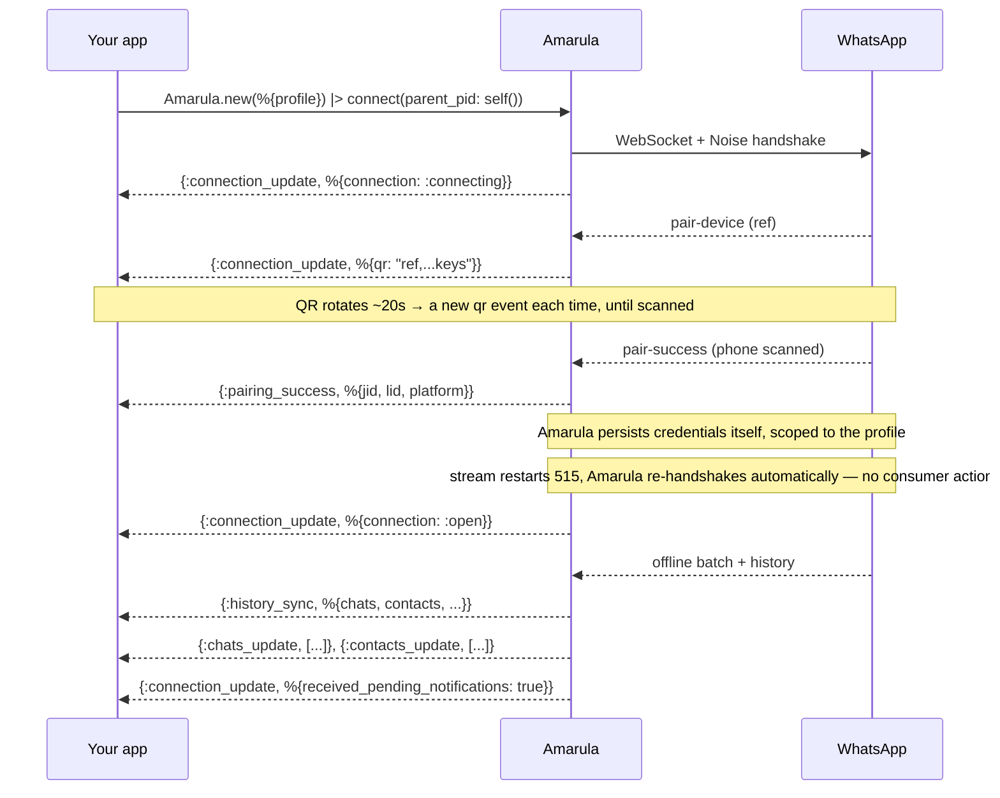
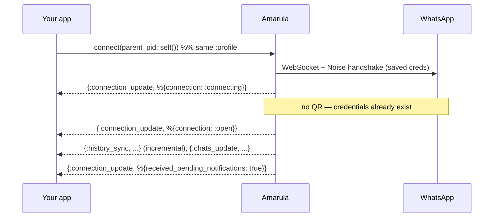
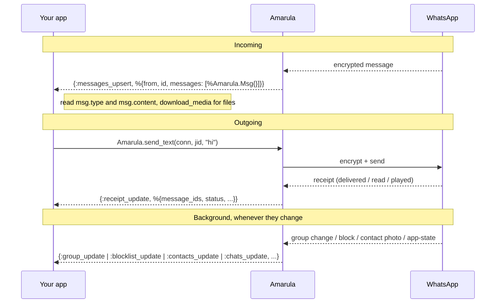
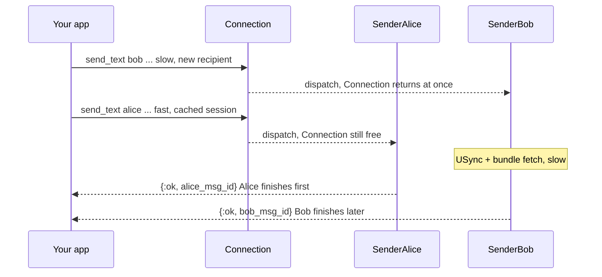

# Amarula

[](https://github.com/tubedude/amarula/actions/workflows/elixir.yml)
[](https://hex.pm/packages/amarula)
[](https://hexdocs.pm/amarula)
[](LICENSE)

A **WhatsApp Web client for Elixir** — connect to WhatsApp the way the
web/desktop app does: pair once by scanning a QR code with your phone, then send
and receive messages from your own Elixir code.

Amarula is a faithful port of [Baileys](https://github.com/WhiskeySockets/Baileys)
(the TypeScript WhatsApp Web library) to idiomatic Elixir/OTP. It speaks the real
protocol end to end: the Noise handshake, the Signal Protocol for end-to-end
encryption, WhatsApp's binary message format, multi-device (LID), groups, and
history sync.

> **⚠️ Unofficial — use at your own risk.** Amarula is not affiliated with,
> endorsed by, or sponsored by WhatsApp or Meta. WhatsApp does not support
> third-party clients, and automating an account can violate
> [WhatsApp's Terms of Service](https://www.whatsapp.com/legal/terms-of-service).
> **WhatsApp may ban any number you use with it**, with no warning and no appeal.
> Only use accounts you own and can afford to lose; never use it for spam, bulk
> messaging, or anything against WhatsApp's terms. The maintainers provide this
> software as-is (see [LICENSE](LICENSE)) and take no responsibility for banned
> accounts or any other consequences of its use.

## Features

- QR-code (and phone-number) pairing, with credentials persisted per **profile** (reconnect without re-pairing)
- Send/receive **text, media** (image/video/audio/document/sticker), **reactions, edits, deletes**
- **Replies & mentions**, **view-once** media, **PTV** round video notes, **albums**
- **1:1 and group** messaging; **group invites as messages**, **member tags**, **events**
- **Polls** — create, **cast votes**, and tally
- **Pin/unpin** and **keep-in-chat**, **presence/typing/read** receipts, **contacts & location**
- **History sync** (your existing chats load on link); **LID↔PN resolution** + a `:lid_mapping_update` event
- Optional **Android client** registration (receive view-once media)
- A **pluggable storage** backend (file or DETS out of the box) and **send/receive plugins** (Req-style)
- Many independent connections in one VM — no global state

## Install

```elixir
def deps do
  [
    {:amarula, "~> 0.4"}
  ]
end
```

## Quick start

```elixir
# Start a connection. Events (the QR code, incoming messages) are delivered to
# parent_pid — here, the current process.
{:ok, conn} =
  Amarula.new(%{profile: :me})
  |> Amarula.connect(parent_pid: self())

# First run: you get a QR code. Print it and scan it on your phone:
#   WhatsApp → Settings → Linked Devices → Link a device
receive do
  {:amarula, :connection_update, %{qr: qr}} when is_binary(qr) ->
    {:ok, art} = Amarula.render_qr(qr)
    IO.puts(art)
end

# Once linked you get an :open update — now you can send.
receive do
  {:amarula, :connection_update, %{connection: :open}} -> :ready
end

Amarula.send_text(conn, "5511999999999@s.whatsapp.net", "hello from Elixir!")
```

`:profile` names this account's stored credentials, so the next run reconnects
without a new QR. Prefer pairing from the shell? `mix amarula.pair my_profile`
does the QR dance for you — see [Pairing](#pairing-with-a-phone-code).

> **Credentials land in `./amarula_data/`** (override with `AMARULA_DATA_DIR` or
> the `:storage` config), scoped per profile. That folder holds your account's
> live Signal session keys — treat it like a secret: add `/amarula_data/` to your
> app's `.gitignore` and keep it out of images and logs.

### In your supervision tree

For a **fixed, known-at-boot set of accounts**, start them declaratively with
`Amarula.child_spec/1` instead of calling `connect/2` by hand — each `{Amarula, …}`
child comes up (and is restarted) with your app:

```elixir
children = [
  MyApp.WhatsAppRouter,                                  # your event sink (a named process)
  {Amarula, profile: :sales,   parent: MyApp.WhatsAppRouter},
  {Amarula, profile: :support, parent: MyApp.WhatsAppRouter}
]

Supervisor.start_link(children, strategy: :one_for_one)
```

`:parent` is the event sink (pass a **registered name** so it survives restarts);
the rest is the `new/1` config. Each child gets a distinct id of `{Amarula, profile}`,
so profiles coexist. This is for **already-paired** accounts (pair first with
`mix amarula.pair`) — for an unbounded/dynamic set your users add at runtime, start
connections under your own `DynamicSupervisor` with `connect/2`.

### The QR code

`qr` is a plain string — four comma-separated fields
(`ref,noiseKeyB64,identityKeyB64,advSecretKeyB64`), where `ref` rotates every
~20s: each rotation emits a fresh `:connection_update`, so re-render on each.
Render it as-is; don't reformat.

For terminals, `Amarula.render_qr/1` (shown in the quick start) returns
ready-to-print ASCII art. For a web app or anywhere a terminal won't do, render
the same string to an image — e.g. with [`qr_code`](https://hex.pm/packages/qr_code),
which Amarula already depends on:

```elixir
{:amarula, :connection_update, %{qr: qr}} when is_binary(qr) ->
  qr |> QRCode.create() |> QRCode.render(:png) |> QRCode.save("qr.png")
```

### Pairing with a phone code

When you can't scan a screen — a headless server, CI, or a consumer that drives
pairing programmatically — link with an **8-character phone code** instead of a QR.
On the phone it's *WhatsApp → Linked Devices → Link with phone number instead*.

Call `Amarula.request_pairing_code/3` **during the QR window** (on the first
`:connection_update` that carries a `qr`, while still unregistered). It returns the
code and also emits a `:pairing_code` event; from there the flow is identical to QR
(`:pairing_success` → 515 restart → `:open`):

```elixir
{:ok, conn} =
  Amarula.new(%{profile: :me})
  |> Amarula.connect(parent_pid: self())

# The first qr event is your cue to request a code instead of rendering the QR.
receive do
  {:amarula, :connection_update, %{qr: qr}} when is_binary(qr) ->
    {:ok, code} = Amarula.request_pairing_code(conn, "5511999999999")  # E.164 digits
    IO.puts("Enter this in WhatsApp → Linked Devices → Link with phone number: #{code}")
end

receive do
  {:amarula, :connection_update, %{connection: :open}} -> :ready
end
```

Pass `custom_code: "ABCD1234"` to fix the code instead of taking a random one.

**Pair from the shell — `mix amarula.pair`.** This Mix task ships in the package,
so it works from **any project that depends on Amarula** (the `examples/` scripts
do not ship — they're only in the Amarula repo). It's the intended way to get a
user linked before starting your app/agent:

```bash
mix amarula.pair my_profile                       # QR
mix amarula.pair my_profile --phone 5511999999999 # phone code
```

Credentials persist under `AMARULA_DATA_DIR` (default `./amarula_data`), scoped to
the profile, so your app then connects with `Amarula.new(%{profile: :my_profile})`
without re-pairing. (Inside the Amarula repo itself, `mix run examples/pair.exs
<profile> [phone]` does the same for local development.)

## Receiving & replying

In a real app the event sink is a GenServer: connect with `parent_pid: self()`
in `init/1`, and every event arrives in `handle_info/2`. Incoming messages are
`%Amarula.Msg{}` structs — a `type` and a friendly `content`, never the raw
protobuf — and `msg.channel` is the address you reply to (works for 1:1 and
groups alike):

```elixir
defmodule MyApp.WhatsApp do
  use GenServer

  def start_link(opts), do: GenServer.start_link(__MODULE__, opts, name: __MODULE__)

  @impl true
  def init(opts) do
    {:ok, conn} =
      Amarula.new(%{profile: Keyword.fetch!(opts, :profile)})
      |> Amarula.connect(parent_pid: self())

    {:ok, %{conn: conn}}
  end

  @impl true
  def handle_info({:amarula, :messages_upsert, %{messages: msgs}}, state) do
    for %Amarula.Msg{from_me: false, type: :text, content: text, channel: chan} <- msgs do
      Amarula.send_text(state.conn, chan, "echo: " <> text)
    end

    {:noreply, state}
  end

  # Everything else (:connection_update, :receipt_update, ...) — take what you need.
  def handle_info({:amarula, _type, _data}, state), do: {:noreply, state}
end
```

A fuller version of this GenServer — QR printing, polls, plugins, auto-read —
is [`examples/connection.ex`](https://github.com/tubedude/amarula/blob/main/examples/connection.ex),
ready to copy into your app.

### Media

`send_media/5` takes the raw file bytes (Amarula encrypts and uploads them);
inbound media messages carry only pointers, so call `download_media/1` to fetch
and decrypt the bytes:

```elixir
# Send: type is :image | :video | :audio | :document | :sticker
Amarula.send_media(conn, jid, :image, File.read!("photo.jpg"), caption: "hi")

# Receive: a %Msg{type: :media} arrives in :messages_upsert
{:ok, bytes} = Amarula.download_media(msg)
File.write!(msg.content.file_name || "received.jpg", bytes)
```

One gotcha: for `:audio`, pass `seconds:` (the clip duration) — Amarula does no
media processing, and iPhone recipients may fail to play longer clips without it.

### Reactions & replies

The send functions that target an existing message take the received `%Msg{}`
directly:

```elixir
Amarula.send_reaction(conn, msg, "👍")                       # "" removes it
Amarula.send_text(conn, msg.channel, "got it", quoted: msg)  # quoted reply
```

### Groups

Group operations live on `Amarula.Group`; a group is just another send target:

```elixir
{:ok, group} = Amarula.Group.create(conn, "Team", ["5511999999999@s.whatsapp.net"])
Amarula.send_text(conn, group.address, "welcome!")

group_jid = Amarula.Address.to_jid!(group.address)
{:ok, code} = Amarula.Group.invite_code(conn, group_jid)
# → share https://chat.whatsapp.com/<code>
```

`Amarula.Contacts` (is this number on WhatsApp? LID↔PN resolution) and
`Amarula.Profile` (picture, status) follow the same pattern.

## Test your bot offline

`Amarula.Testing` starts a sandbox connection — no WhatsApp, no network — and
feeds synthetic messages through the **real** receive pipeline, so the `%Msg{}`
your bot sees is exactly what production would deliver. Sends short-circuit to
`{:ok, msg_id}`:

```elixir
test "replies pong to ping" do
  {:ok, conn} = Amarula.Testing.start_offline(profile: :test_pong)

  Amarula.Testing.deliver_text(conn, from: "15551234567@s.whatsapp.net", text: "ping")

  assert_receive {:amarula, :messages_upsert, %{messages: [%Amarula.Msg{content: "ping"}]}}
  # ... drive your handler, assert on its reply
end
```

## Events & connection flow

Everything reaches you as `{:amarula, type, data}` messages at `parent_pid`. You
never poll — you react to events. Here's what to expect, and when.

### First link (new device)



> **You never handle credentials.** Amarula persists them itself, scoped to the
> connection's `:profile` (via the pluggable storage). The next boot with the same
> profile reconnects without a QR — no `:creds_update` event, no saving on your
> side.

> The **515 stream restart** after pairing is handled internally — Amarula
> reconnects and re-handshakes with the new credentials on its own. You don't
> handle it; just wait for `connection: :open`.

### Re-login (already paired)



### Steady state (messaging)



### Sending (synchronous to you, concurrent underneath)

`Amarula.send_text/3` (and friends) **block until the send actually completes** —
you get the real `{:ok, msg_id}` or `{:error, reason}`, not a fire-and-forget
acknowledgement. But under the hood sends are **non-blocking and concurrent**:

- The connection process doesn't wait — it hands your send to a **per-recipient
  sender** and is immediately free for the next send.
- Sends to **different recipients run in parallel**; sends to the **same
  recipient are serialized**, so that recipient's Signal session is advanced by
  one send at a time.
- Your caller still waits for *its own* result — the sender replies to you
  directly when done. A fast send (cached session) returns while a slow one (new
  recipient: USync + key-bundle fetch) is still in flight.

**The consequence:** if you fire two sends in parallel (from two processes, or
two `Task`s), you may get the **second** one's result *before* the first's — each
returns when its own send finishes, not in call order. Within a single sequential
caller it still looks plain synchronous; the concurrency only shows when you
actually send in parallel.



> Want true fire-and-forget? Wrap the call in your own `Task` — the library gives
> you the honest result and lets *you* choose the concurrency.

### Event reference

| Event | Data | When |
|-------|------|------|
| `:connection_update` | `%{connection: :connecting\|:open, qr, received_pending_notifications}` (partial) | lifecycle transitions; `qr` during pairing |
| `:pairing_success` | `%{jid, lid, platform}` | phone scanned the QR (first link only) |
| `:messages_upsert` | `%{from, id, messages: [%Amarula.Msg{}]}` | an incoming message (see `Amarula.Msg`) |
| `:receipt_update` | `%{message_ids, from, participant, status, timestamp}` | a message you sent was delivered/read/played |
| `:history_sync` | `%{chats, contacts, ...}` | initial + incremental history download |
| `:chats_update` / `:contacts_update` | `[%Amarula.Chat{}]` / `[%Amarula.Contact{}]` | history / app-state sync |
| `:group_update` | `%{group, author, action}` | a group's membership/metadata changed |
| `:presence_update` | `%{jid, participant, presence, last_seen}` | a contact's presence / typing state |
| `:blocklist_update` | `[%{jid, action}]` | someone was blocked/unblocked |
| `:lid_mapping_update` | `[%{lid: Address, pn: Address}]` | new LID↔PN mappings learned (see `Amarula.Contacts.pn_for_lid/2`) |
| `:error` | a reason term | a connection error |

> The full, authoritative event list is `t:Amarula.event/0`.

## Try it

Runnable examples live in [`examples/`](https://github.com/tubedude/amarula/tree/main/examples):

```bash
# Pair a device and listen (shows a QR, then prints incoming messages)
mix run examples/pair.exs my_profile

# Send one message through a supervised connection, then exit
mix run examples/send_message.exs 5511999999999 "hello from amarula"
```

[`examples/connection.ex`](https://github.com/tubedude/amarula/blob/main/examples/connection.ex) is a small supervised
GenServer wrapper you can copy into a real app.

## Configuration

Most settings are **per-connection**, passed to `Amarula.new/1` (you usually only
set `:profile`):

```elixir
Amarula.new(%{
  profile: :me,                                   # required — names + scopes stored state
  storage: {Amarula.Storage.File, root: "./data"},# storage backend (defaults to File)
  sync_full_history: false,                        # skip the full history download
  max_retries: 5,
  connect_timeout_ms: 30_000
})
```

The full key list (with defaults) is in `Amarula.Config`.
Only the pluggable backends are app-global:

```elixir
config :amarula, :default_storage_adapter, Amarula.Storage.File
config :amarula, :retry_cache_adapter, Amarula.RetryCache.ETS
```

### Logging

Amarula logs through `Logger`. Almost everything is `:debug`; only connection
lifecycle, pairing, and errors are `:info`+. So at `config :logger, level: :info`
your console won't be flooded. To quiet the connection specifically:

```elixir
Logger.put_module_level(Amarula.Connection, :warning)
```

For production observability prefer `Amarula.Telemetry`
(structured `:telemetry` events) over log scraping.

## Documentation

- `Amarula` — the public API and entry point
- [`docs/INFRASTRUCTURE.md`](https://github.com/tubedude/amarula/blob/main/docs/INFRASTRUCTURE.md) — process model, supervision
  tree, and send/ack/crash semantics (the living architecture reference)
- [`docs/`](https://github.com/tubedude/amarula/tree/main/docs) — design/port plans (point-in-time)
- [`AGENTS.md`](https://github.com/tubedude/amarula/blob/main/AGENTS.md) — Elixir coding guidelines for this codebase

## Development

```bash
mix deps.get        # install dependencies
mix compile         # compile
mix test            # run the test suite
mix format          # format
mix credo           # lint
mix dialyzer        # type checking
```

After cloning, enable the shared git hooks once so commits are format-checked
locally (the same check CI runs), instead of finding out in CI:

```bash
git config core.hooksPath .githooks   # runs `mix format --check-formatted` pre-commit
```

### Protocol Buffers

When the WhatsApp protocol definitions in `proto/wa_proto.proto` change,
recompile them:

```bash
protoc -I proto --elixir_out=package_prefix=amarula.protocol:lib/amarula/protocol/proto wa_proto.proto
```

This regenerates `lib/amarula/protocol/proto/wa_proto.pb.ex` under the
`Amarula.Protocol.Proto.*` namespace.

## License & credits

Amarula is released under the [MIT License](LICENSE), © 2026 Roberto Trevisan.

It is a port of [Baileys](https://github.com/WhiskeySockets/Baileys) (© 2025
Rajeh Taher/WhiskeySockets), also MIT-licensed — that license permits this use,
and Baileys' copyright + permission notice are retained in [LICENSE](LICENSE) and
[NOTICE](NOTICE) as it requires. Huge thanks to the Baileys authors for the
reference implementation.

**Unofficial.** Not affiliated with, endorsed by, or sponsored by WhatsApp or
Meta. Use it on accounts you control and in line with WhatsApp's terms.
