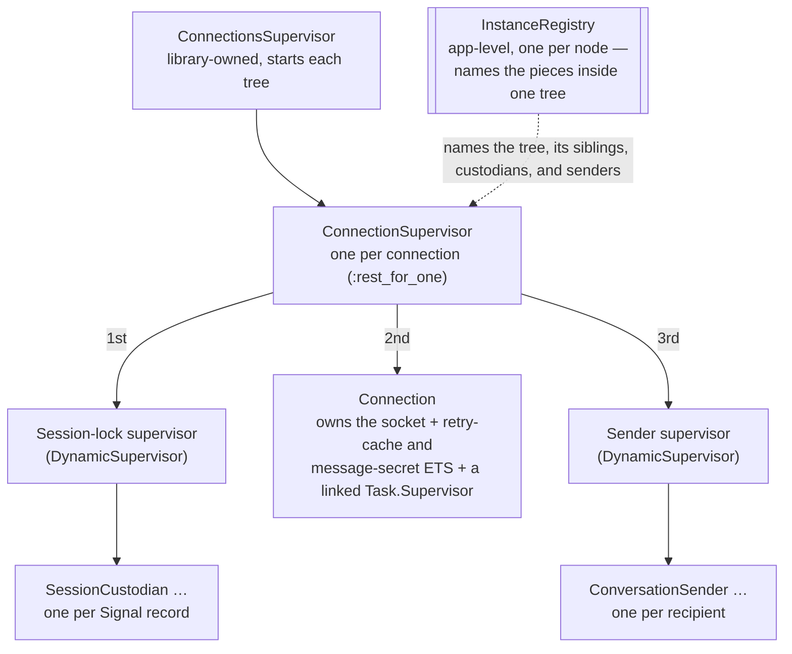

# Infrastructure

How a connection is built, supervised, and torn down; how messages flow out and
in; and how failures stay contained.

This file tracks current reality. Point-in-time design plans live in `docs/plans/`
and go stale by design. When they disagree with this file, this file wins.

## Overview

A connection is one independent supervision tree. Each WhatsApp profile gets its
own tree, so one account can run without taking down another.

At a high level, the design is simple:

- one process owns the WebSocket and keeps the connection alive;
- one process per recipient serializes sends for that recipient;
- one process per Signal record serializes the read/modify/write on that record so
the double ratchet cannot be corrupted by concurrent send/receive work.

That is why a connection tree has three roles: the connection itself, a sender
supervisor for outbound work, and a custodian supervisor for crypto state.

The tree is started by a library-owned supervisor. Inside that tree, the
connection process is the center of gravity: it owns the socket, runs the
handshake, correlates IQ replies, persists credentials, exposes the public API,
and sends events back to the consumer. Everything else in the tree exists to
support that work.

Here is the shape of one tree:



The `1st`/`2nd`/`3rd` labels are the `:rest_for_one` startup order. Session
custodians come before `Connection` on purpose; see [Session Custody](#session-custody).
`Connection`'s off-process work — media encrypt+upload and history-sync downloads,
both of which hold `Connection`'s pid and round-trip through it — runs under a
`Task.Supervisor` that `Connection` starts **linked** in its own `init`, not a
tree sibling. So the supervisor (and every in-flight task) dies with `Connection`
rather than outliving it against a stale pid, and a fresh one comes up on restart.

The diagram above shows the internal wiring of one connection tree. It does not
show the other registry, because that registry serves a different job: it maps a
profile to the current connection process. The instance registry names the pieces
inside one tree; the profile registry answers the question "which connection is
currently serving this profile?" That distinction is explained in
[The Two Registries](#the-two-registries).

Starting a tree is straightforward. The library creates a fresh supervision tree
under `Amarula.ConnectionsSupervisor`, then returns the pid of the connection
process. From that point on, calls such as `send_text/3` go straight to that
connection process; there is no extra relay process in the middle.

The tree is supervised by the library, not linked to the caller. If a connection
crashes, the consumer sees that as an event through `parent_pid`, not as an exit
signal that could take the consumer down.

No per-tree registry is needed for the internal wiring. The tree supervisor, its
sibling roles, every `ConversationSender`, and every `SessionCustodian` are all
named from the app-level `Amarula.InstanceRegistry`, keyed by the connection's
`instance_id`. This keeps different connections from colliding on a name and
avoids minting atoms for every connection.

## The Processes

### Connection

The single per-connection process and the consumer's endpoint. It owns:

- the WebSocket client and Noise handshake state (read/write ciphers);
- IQ correlation (matching responses to in-flight requests);
- login, pairing, and the 515 restart;
- credential resolve/persist through the Storage seam;
- the consumer API (`send_*`, `group_*`, presence, reads, downloads);
- dispatch of inbound frames and delivery of events to `parent_pid`;
- the per-connection retry-cache ETS table (see [Retry Cache](#retry-cache)) and
  the message-secret store's ETS table (inbound `messageSecret`s held for the
  15-min edit window so newer clients' `secretEncryptedMessage` edit envelopes
  can be decrypted — `Amarula.MessageSecretStore` / `EditEnvelope`, #30; same
  init-owned, restart-clean lifecycle as the retry cache). Like the retry cache
  it is a pluggable seam: the default `MessageSecretStore.ETS` adapter owns this
  table, but a consumer can supply a `MessageSecretStore.ReadOnly` adapter backed
  by their own message store, in which case Connection owns no table for it.

It is a large coordinator on purpose. The decision and domain logic live in their
own pure modules (`Router`, `IQ`, `Login`, the message and signal layers).
`Connection` wires them together and owns the side effects.

### The Event Sink (Re-Attachable)

Consumer events (`{:amarula, type, data}`) go to a single **sink** held in
`Connection` state. There is no subscriber registry and no relay hop.

The sink is set at `connect/2` (the `:parent`/`:parent_pid` opt, default the
caller). It can be re-pointed on a live connection with `Amarula.set_parent/2`, so
a consumer whose process restarts can re-attach without bouncing the websocket.

A sink is a `t:Amarula.Connection.sink/0`: a `pid`, a registered name, a
`{:via, …}` tuple, or `{name, node}`. Pids and names differ in restart-safety:

- A **raw pid** is not restart-safe. If the consumer restarts under a new pid, the
  old pid points at a corpse, and only `set_parent/2` recovers it.
- A **name** is restart-safe by construction. `emit_event` resolves it per event
  (via `GenServer.whereis/1`), so it re-attaches to the consumer's current pid
  automatically — across the consumer's restart *and* this `Connection`'s own
  restart (which otherwise re-seeds the sink from the static child spec).

This mirrors what `ProfileRegistry` does for the reverse direction: addressing the
connection by `profile` instead of a raw pid.

**Monitoring.** `Connection` monitors the sink. When it dies,
`[:amarula, :sink, :down]` telemetry fires (so the loss is observable, not silent),
a raw-pid sink is cleared, and a name sink is left in place to re-resolve.

A name sink that has no holder when first attached carries no monitor yet. This is
not a delivery hole: `emit_event` re-resolves it per event, and the monitor
self-heals off the keep-alive heartbeat (`rearm_sink_if_needed/1`) once a holder
reappears, so `:sink, :down` coverage resumes too.

Events emitted while no sink resolves are dropped. There is no replay buffer — and,
unlike a real socket reconnect, the socket stayed up, so the server won't re-send
them.

### Retry Cache

Not a process of its own. The per-connection retry-cache ETS table is created and
**owned by the `Connection` process** in its `init`, via `RetryCache.ensure_local/2`
(a no-op for adapters with no process-owned resource, e.g. DETS).

Creating it before any reader runs means no lazy-create race and no `try/rescue`
guard. And because the table dies with its owner, a `Connection` crash/restart
recreates it empty — so a poisoned cached entry can never outlive (and crash-loop)
the restart it triggered.

### ConversationSender

One GenServer per recipient JID, started lazily, holding no durable state. Covered
in detail under [Sending](#sending).

### SessionCustodian

One GenServer per Signal crypto record — a 1:1 session or a group sender-key —
started lazily, holding a write-through cache of that one record. Covered in detail
under [Session Custody](#session-custody).

### Storage

Not a process. Storage is a config concern — a scope carried on the `Conn` struct —
backed by a pluggable adapter (File or DETS). It holds creds, sessions, sender keys,
LID mappings, device lists, and app-state.

## The Two Registries

There are two distinct registries.

### Instance Registry — Intra-Tree Wiring

`Amarula.InstanceRegistry` is one app-level `Registry` (started by
`Amarula.Supervisor`) that names the infrastructure of *every* connection tree,
keyed by the connection's `instance_id`. It is not a child of any tree. It does
three jobs.

**1. Names the tree and its siblings.** The tree supervisor registers under
`{:supervisor, instance_id}`; `Connection`, the sender supervisor, and the custodian
supervisor register under `{instance_id, role}`. So the tree is addressable and
siblings find each other by role across restarts — with no global atom names, and
(unlike the old design) no hashed atom minted per connection.

**2. Maps `{instance_id, recipient_jid} → sender pid`.** This is the load-bearing
reason the registry exists. The recipient key space is unbounded and
user-controlled: every phone number you message becomes a key. Static atom names
can't work here, because atoms are never garbage-collected and an unbounded atom
table would eventually crash the VM. A Registry keyed by the JID term find-or-starts
a sender per recipient and auto-unregisters it on the sender's death, with no atom
growth.

**3. Maps `{instance_id, {:session, addr}}` and
`{instance_id, {:sender_key, name}}` → custodian pid.** Same shape and reason as job
2: a contact's or group's key space is just as unbounded, so custodians
find-or-start and auto-unregister the same way senders do. See
[Session Custody](#session-custody).

`instance_id` is a `make_ref()` minted per `start_instance/2`. It namespaces a
connection's entries in the shared registry so trees never collide. It is ephemeral
— re-minted on every start — so it is *not* a stable consumer handle.

**Node-local by design, and not pluggable.** Unlike the profile registry below,
this is a plain local `Registry` with no config seam. There is no way to swap in
`:global`, `Horde.Registry`, or a custom naming, and that boundary is deliberate.
Its keys all carry a `make_ref()`, which is meaningless on another node, so
distributing this Registry would buy nothing. A connection's whole supervision tree
lives on one node by design.

Cross-node reach is provided one level up, at the profile-registry lookup seam (see
[Cluster Reach](#cluster-reach)): the consumer distributes the *handle*
(`profile → pid`) across the cluster, while each connection's internal wiring stays
local. Moving a running tree between nodes is out of scope.

### Profile Registry — One Connection per Profile

`Amarula.ProfileRegistry` is an app-level `Registry` (started by
`Amarula.Supervisor`) mapping `profile → Connection pid`. It has two jobs.

**1. One connection per profile.** Starting a profile that is already live returns
`{:error, {:already_running, pid}}`. The registration happens atomically in
`Connection.init` (the pre-check is just a fast path). This is a correctness
invariant, not mere deduplication: two WebSockets on one set of credentials would
corrupt the shared Signal ratchet.

**2. Restart-safe handle.** `Amarula.whereis(profile)` resolves to the current pid,
and `Amarula.via(profile)` is a `:via` handle usable anywhere a `conn()` is
accepted. On a Connection restart, `init` re-registers the same profile key, so the
handle keeps resolving — where a raw pid from `connect/2` would go stale.

The key is the `profile`. Uniqueness is the consumer's responsibility: the library
trusts `profile ↔ credentials` to be 1:1 and does not fingerprint or validate it.

**Releasing a profile.** `disconnect/1` only closes the WebSocket; the tree stays up
and may reconnect, so the profile stays registered. To fully release it — stop the
whole tree and free the registration — use `Amarula.stop/1` (by pid or profile). The
tree is found by a name derived from its `instance_id`, so the consumer doesn't need
to hold the supervisor pid.

#### Cluster Reach

The profile registry is a config seam: `:registry` is `{module, name}` or a bare
`name`. The library only uses the standard `Registry`/`:via` contract, so
**uniqueness reach equals the registry's reach**:

- the default local `Registry` → one connection per profile *per node*;
- a `:via`-compatible cluster registry (`Horde.Registry`, a `:global`/`:pg` shim) →
  one connection per profile *cluster-wide*, where "already registered" means
  "running anywhere in the cluster."

The consumer distributes credentials and picks the registry; Amarula enforces
one-per-profile against whatever reach that registry has. The library never decides
clustering.

Note that `:global` is best-effort — a netsplit can briefly allow two registrations,
reconciled on heal. So a production setup usually pairs it with an external lease (a
DB row or Redis key the orchestrator holds per profile). The seam composes with that
rather than replacing it.

## Session Custody

A 1:1 Signal session (and, uniformly, a group sender-key) is persisted as **one**
opaque blob — no field-level merge. And it is mutated from two different processes:
`ConversationSender` on send (`encrypt`), and `Connection` on receive (`decrypt`,
inline in `MessageDecryptor`).

Two processes, one shared record, no lock between them is exactly a lost-update
race. A concurrent send and receive to the same contact can interleave the
`load → mutate → store` and silently fork the ratchet.

`Amarula.Protocol.Signal.SessionCustodian` closes that race. Every
read-modify-write of a given record funnels through the **one** custodian process
for that record, so send and receive can no longer clobber each other.
[`docs/CUSTODIAN_BENCHMARKS.md`](CUSTODIAN_BENCHMARKS.md) measures what happens with
the lock removed: a lock-free version fails 3-in-4 concurrent rounds under realistic
timing, mostly silently.

**The leaf invariant — why this never deadlocks.** A custodian touches only
`Amarula.Storage` and the pure cipher/builder code. It calls *nobody*: no IQ, no
socket, no callback into `Connection` or a sender.

That is the whole point. `ConversationSender` already blocks on `Connection` (USync,
prekey-bundle, and relay calls), so a `Connection → sender` blocking call would
deadlock. But `Connection → custodian` and `sender → custodian` are safe, because
the custodian waits on no one — it always makes progress and replies.

This is also why the custodian supervisor sits **first** in the `:rest_for_one`
order, before `Connection`. A `Connection` restart must not wipe custodians out from
under an in-flight sender, and a custodian — being a leaf — never needs `Connection`
to make progress in the first place.

**Write-through cache, never write-back.** A 1:1 record is loaded once and kept in
memory for as long as the custodian lives, and persisted on *every* mutation before
the reply is sent. Storage is always current, so an idle-stop or crash can't lose a
ratchet advance. A write failure discards the advance and returns an error, rather
than caching a state that storage never actually holds. (Group sender-key ops aren't
cached this way — the group cipher does its own storage I/O.)

**Lifecycle** mirrors `ConversationSender`'s:

- **Lazy find-or-start:** `Registry.lookup`, else `DynamicSupervisor.start_child`,
  with `{:error, {:already_started, pid}}` treated as success so a lost start race
  still converges on one custodian.
- **`restart: :temporary`.**
- **Idle-shed timer:** default 30s, overridable via `config[:custodian_idle_ms]`.
  Longer than the sender's 1s default, since a crypto record is more expensive to
  cold-restart than an empty sender.

Callers never hold a custodian pid across that idle-shed window. Every op resolves
the record's custodian and calls it in one step, retrying find-or-start (up to 5
times) if the custodian died between resolve and call. A bare call into a
mid-`:stop` pid would otherwise `:exit` the caller — and on the receive path that
caller is `Connection`, the socket owner.

**First-contact straddles the lock, deliberately.** A prekey-bundle fetch needs the
socket, so it can't run inside the custodian's critical section — that would break
the leaf invariant. Session *creation* therefore splits in two:

1. The caller fetches the bundle **outside** the lock.
2. It hands the bundle to the custodian's `inject` op, which re-checks whether an
   inbound `pkmsg` already established a session while the fetch was in flight
   (`:if_absent` mode) before installing it.

So a race between "we're about to start a session" and "they already started one"
can't clobber a live ratchet.

## Sending

`Amarula.send_text/3` → `Connection` → the recipient's `ConversationSender`. The
sender first runs the **send-step plugin pipeline** (which may transform the
message or halt the send outright — the built-in retry-cache step records here),
then a linear `ctx → ctx` pipe:

```
send-steps         (plugin pipeline; may transform or halt — e.g. retry-cache)
  → resolve_devices  (device cache, else USync)
    → ensure_sessions  (stored sessions, else a prekey-bundle fetch injected
                         through the record's SessionCustodian)
      → encrypt        (per device; plain vs DSM; each ratchet advanced through
                         the record's SessionCustodian — see
                         [Session Custody](#session-custody))
        → relay        (build the frame, send the <participants> stanza)
```

Every step that mutates a Signal record — the `ensure_sessions` bundle inject and
each per-device `encrypt`, and on the group path both the sender-key distribution
build and the one-shot skmsg encrypt — funnels through that record's
`SessionCustodian`. The sender itself never writes crypto state directly.

**Why a process per recipient.** The sender holds no state of its own — not even the
ratchet, which lives in `SessionCustodian`. So what does its per-recipient lock
protect?

It keeps one recipient's whole *pipeline* — device resolution, session ensure,
per-device encrypt, relay — from interleaving with itself. Two concurrent calls to
the same recipient can't race on device-list state or emit an out-of-order
`<participants>` stanza. Serial *within* a recipient, parallel *across* recipients.
Ratchet safety is a separate concern, owned one level down by the
`SessionCustodian` (see [Session Custody](#session-custody)); the sender's lock is
purely about the pipeline, not the crypto record.

Because the sender holds nothing, it is cheap to lose and respawn. It gets current
credentials handed to it per send — creds change after login, so a cached snapshot
would encrypt stale.

### ConversationSender Lifecycle

One sender per recipient JID, `restart: :temporary`.

- **Identity.** The sender *is* its recipient: registered in `InstanceRegistry`
  under `{instance_id, recipient_jid}`, at most one per recipient at a time.
- **Birth.** Lazy. The first `deliver/2` to a recipient with no live sender does
  find-or-start: `Registry.lookup`, else `DynamicSupervisor.start_child`. The
  `{:error, {:already_started, pid}}` branch keeps it race-safe. (In practice only
  `Connection` calls `deliver`, so starts for one recipient are already serialized.)
- **Life.** It serializes that recipient's sends — one pipe at a time, the narrower
  lock described above. Different recipients run in parallel. It holds no durable
  state: sessions and keys live in Storage, and the consumer's `from` is parked in
  `Connection`.
- **Death.** Three ways, all of which auto-unregister the registry key:
  1. *Idle* — each send re-arms an idle timer (`idle_ms`, default 1s, overridable
     via `config[:sender_idle_ms]`); after that long with no further send,
     `{:stop, :normal}`. The short default avoids a long-lived process tail after a
     fan-out; lingering only buys warm reuse (no respawn or session re-read).
  2. *Crash* — a raise in the pipe (Signal error, USync failure, bad bundle).
     `:temporary` means no restart; in-flight and queued sends are lost.
  3. *Shutdown* — the tree going down takes it with it.
- **Rebirth.** The next `deliver/2` starts a fresh sender that re-reads sessions from
  Storage.

### Completion: Ack-on-Send

A `send_*` call returns `{:ok, msg_id}` only when the **server** confirms with
`<ack class="message" id=msg_id>` — not when the frame is merely written.

The lifecycle of one parked send:

| Stage | Where | What happens |
| --- | --- | --- |
| **1. Park** | `Connection`, at dispatch | Mint the `msg_id`; store the caller's `from` in `pending_acks` (keyed by `msg_id`, with the recipient JID and a freshly-armed **ack-timeout timer**); dispatch to the sender. `Connection` does **not** block — it returns `{:noreply, …}` and is free for other sends. The wait for the server is fully set up here, before the sender even runs. |
| **2. Run** | Sender | Run the send-steps plugin pipeline, then the pipe (`resolve_devices → ensure_sessions → encrypt → relay`), blocking on `Connection.query_iq` round-trips *in the sender's own process* so `Connection` stays free to route those IQ replies. A plugin halt short-circuits before the pipe and is reported as a failure (step 3). |
| **3. Report back** | Sender | **Asymmetric — see below.** On success, report nothing. On failure, report `{:send_failed, msg_id, reason}`. |
| **4. Resolve** | `Connection`, on inbound `<ack>` | A plain ack resolves the success shape (default `{:ok, msg_id}`); an ack with an `error` attr resolves `{:error, {:send_rejected, code}}`. Either way the entry is dropped, so a duplicate ack is a harmless no-op. |
| **5. Or time out** | `Connection` | No confirmation within `@ack_timeout_ms` (default 30s, overridable via `config.ack_timeout_ms`) → `{:error, :ack_timeout}`. |

**The asymmetry in step 3 is the design's core.** The report-back differs by
outcome:

- **Success: the sender reports nothing.** The frame is on the wire, and the parked
  entry plus ack-timeout from step 1 already cover what comes next. A "frame went
  out" message would be inert — `Connection` would do nothing with it. (This is why
  there is no `:send_relayed` message: it would be a signal nobody acts on.)
- **Failure: the sender reports `{:send_failed, msg_id, reason}`.** No frame went
  out, so no `<ack>` will ever come. `Connection` must resolve the parked `from` with
  the error *now*, or the caller hangs to the ack-timeout. Failure is the only case
  the sender must signal — precisely because it's the case the dispatch-time wait
  can't resolve on its own.

So the **happy path is silent** (the server's `<ack>` is the confirmation, and
`Connection` is already waiting for it), while **only failure is actively reported**.

A sender that *crashes* mid-pipe is a third case, handled by a monitor rather than a
message: `Connection` monitors each sender and, on its `:DOWN`, fails every parked
send for that recipient with `{:error, {:sender_crashed, reason}}`. See
[Failure Containment](#failure-containment).

**Two subtleties, both about not over-reacting to acks:**

- **Never auto-resend on a phash ack.** A plain ack is success even when it carries a
  phash; only an `error` attr is failure. Auto-resending on phash is the Baileys
  `handleBadAck` loop trap, and we avoid it.
- **Multiple acks for one id** (group / multi-device). A group stanza is a single
  `<message>` with one id, but the server may emit a phash ack ("not all devices
  yet") before the terminal one. We resolve on the *first* no-error ack and treat any
  later ack for that id as a no-op — the server has accepted the message; phash is
  about device propagation, not acceptance. An `error` ack arrives *instead of* a
  plain one, never after, so this can't mask a real failure.

Because `Connection` parks the `from` and routes replies by id, sends to different
recipients complete out of order without blocking each other — a later send can be
acked before an earlier one.

### Offline (Sandbox) Mode

With `offline: true` on the config, the connection has no socket and no peer. A send
must not run the real pipe: USync and bundle-fetch IQs would block forever with
nothing to answer them.

So `deliver_async` short-circuits at the boundary. It mints a `msg_id` and replies
exactly as a confirmed send would (`{:ok, id}`, or `{:ok, id, secret}` for a poll).
Nothing is encrypted and no frame leaves the process, so a consumer's bot logic runs
unchanged against `Amarula.Testing`. A fire-and-forget send (`from == nil`) simply
does nothing.

## Receiving

An inbound frame is decrypted by the Noise layer, decoded into a binary `Node`, and
handed to `Connection.process_server_node/2`. Dispatch is split in two:

1. **`Router.route/1`** is a pure function. It maps a node to a handler tag (an atom
   like `:message`, `:notification`, `:receipt_ack`, `:iq_response`, `:message_ack`)
   based only on the node's tag, `type`/`xmlns` attrs, and first-child tag — never on
   connection state. The explicit catch-all is `:unhandled`, which `Connection` logs
   loudly. Keeping the table pure makes "which frames do we handle?" one readable
   list, testable without a live socket.
2. **`Connection` dispatches** on that tag to the matching handler, which performs
   the side effects.

**The `:message` handler.** It decrypts via `MessageDecryptor` — which, for a 1:1 or
group-sender-key payload, funnels the actual cipher step through that record's
`SessionCustodian` (see [Session Custody](#session-custody)) rather than mutating
Storage directly. It then:

- builds each decrypted payload into an `%Amarula.Msg{}` (a consumer struct — `type`
  + `content`, never the raw proto);
- drops Signal sender-key plumbing (`type == :sender_key`, which is
  group-session-key bookkeeping, not a user message);
- emits the rest as a `:messages_upsert` event to `parent_pid`.

It then sends the delivery receipt the server expects. For a message carrying a
history-sync notification, it also sends an extra `<receipt type="hist_sync">` — the
signal the server waits for to mark the companion's initial sync complete. Without
it, the phone shows the device as "Paused."

**Everything else.** Receipts, notifications, presence, and acks dispatch to their
own handlers and emit their own events (`:receipt_update`, `:group_update`, …).
Consumer events all reach `parent_pid` as `{:amarula, type, data}`.

## Failure Containment

**IQ timeout** (a USync or bundle request never answered) → the pipe step fails →
`{:send_failed, …}` → the caller gets `{:error, reason}`.

**Sender crash mid-pipe.** The caller's `from` lives in `Connection`, not in the
dying sender. Left alone, a crash would leave the caller hanging until the
ack-timeout, then hand back a *mislabeled* `:ack_timeout` (nothing was relayed).

Instead, `Connection` monitors each sender (one monitor per recipient, reused across
that recipient's in-flight sends). On a `:DOWN`, it fails **all** of that recipient's
parked sends with `{:error, {:sender_crashed, reason}}` — promptly and correctly. A
`:normal` idle-stop fails nothing. The monitor is dropped when the recipient's last
parked send resolves, so it doesn't leak. See `docs/plans/SENDER_CRASH_FIX.plan.md`.

**Custodian dies mid-call.** A bare `GenServer.call` into a custodian that died
between resolve and call would `:exit` the *caller* — on the receive path that's
`Connection`, the socket owner, so this must not propagate. Every custodian op
resolves-and-calls in one step and retries find-or-start (up to 5 times) on exactly
that failure, returning `{:error, :custodian_down}` only once all retries are
exhausted. The leaf invariant makes the retry safe: a fresh custodian re-reads
storage, which write-through keeps current. See [Session Custody](#session-custody).

**Connection crash** → the whole instance tree restarts and reconnects as a unit.
Because the tree isn't linked to the consumer, this never propagates an exit signal
to the caller. Custodians, sitting before `Connection` in the `:rest_for_one` order,
are untouched by the restart.

## See Also

- `Amarula.Connection` — moduledoc plus the send / ack / `:DOWN` handlers.
- `Amarula.Protocol.Socket.ConnectionSupervisor` — the tree and the role-name
  helpers.
- `Amarula.Protocol.Socket.Router` — the full inbound routing table.
- `Amarula.Protocol.Messages.ConversationSender` — moduledoc (lifecycle).
- `Amarula.Protocol.Signal.SessionCustodian` — moduledoc (the leaf invariant,
  write-through cache).
- [`docs/CUSTODIAN_BENCHMARKS.md`](CUSTODIAN_BENCHMARKS.md) — concurrency benchmarks
  for the per-record lock.
- `docs/plans/` — point-in-time design plans; may be stale. This doc is current.
