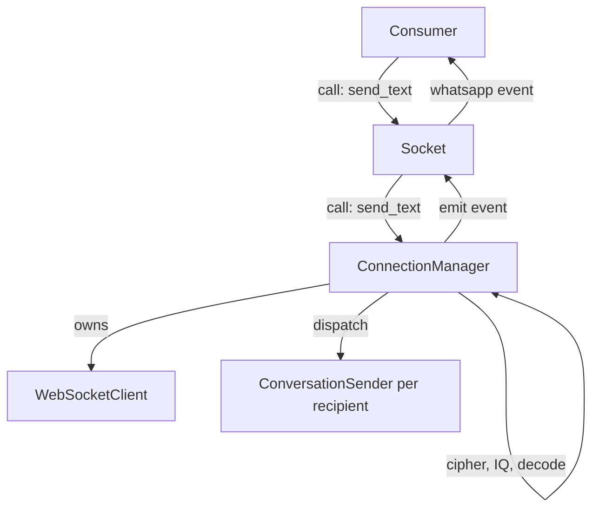
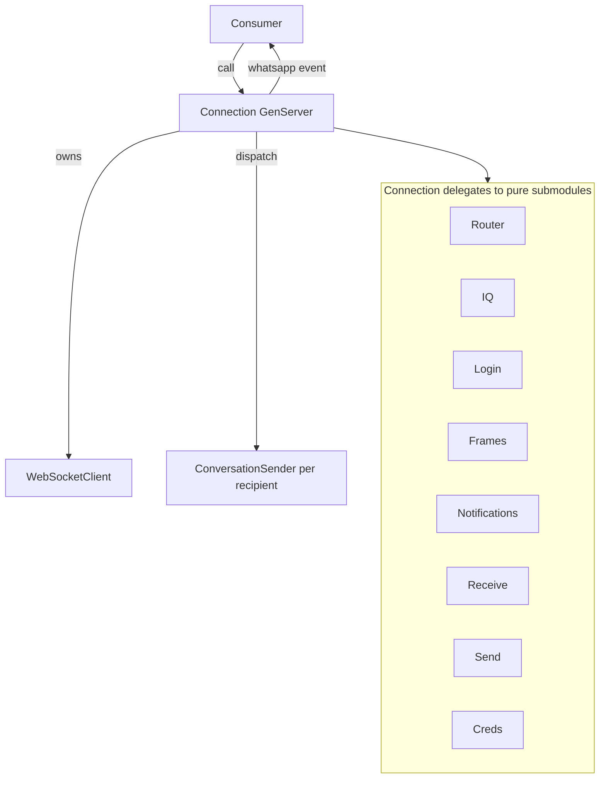
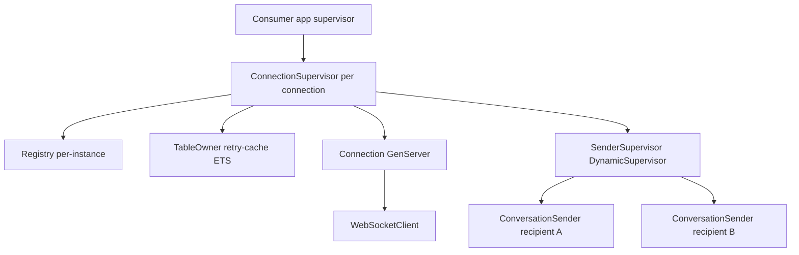
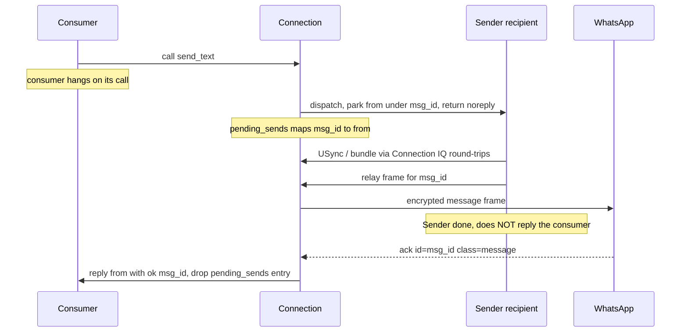

# Merge Socket + ConnectionManager — design plan

## Why

Today there are two per-connection GenServers with backwards names:

- **`ConnectionManager`** (~2900 lines): owns the WebSocketClient, the **noise
  cipher**, frame decode + routing, IQ correlation, login/handshake, sends, server
  notifications. *This is the process that talks to the server.* It is what should
  be called "Socket."
- **`Socket`** (~520 lines): a **thin pass-through**. Every `handle_call` forwards
  to ConnectionManager; every `handle_info` re-emits a CM event to the consumer's
  `parent_pid`. It holds no real state. It is misnamed — it's a facade/relay, not
  the socket.

Consequences of the split:
- **Double indirection on every call** (consumer → Socket → CM) and **every event**
  (CM emits → Socket subscribes → Socket re-emits to parent_pid) — two mailboxes,
  two hops, for no behavioural gain.
- The naming actively misleads (the "merge or not" debate happened *because* the
  names lie about who owns the server conversation).
- The pending feature (send completes on the server `<ack>`) needs the consumer's
  `from` and the decoded `<ack>` in the **same** process. They're split today
  (`from` in Socket, ack in CM), forcing an awkward forward. Merged, it's trivial:
  one process parks `from` by msg_id, replies on the ack.

## Target shape

ONE per-connection GenServer — call it **`Amarula.Connection`** (rename target;
see naming below) — that owns the entire server conversation:

```
ConnectionSupervisor (per connection)         ← "how many / restart" lives here
├── Registry (per-instance)
├── TableOwner (retry-cache ETS)
├── Connection (GenServer)                     ← THE socket: ws + cipher + IQ +
│     └── WebSocketClient (WebSockex proc)        sends + login + consumer API +
│                                                 consumer-event delivery
└── SenderSupervisor (DynamicSupervisor)
      └── ConversationSender (per recipient)
```

`Connection`:
- owns `WebSocketClient` (raw frames), the **noise cipher** (ephemeral, per
  connect), read/write counters, frame decode + `Router`.
- owns IQ correlation (`pending_iqs`), login bootstrap, send dispatch to
  ConversationSenders, server-notification handling.
- **is the consumer's endpoint**: the pid `Amarula.connect/2` returns. Consumer
  `GenServer.call`s land here directly (no relay). Events go straight to
  `parent_pid` (no subscribe/re-emit bridge).

`ConnectionSupervisor` keeps its current job (start the tree, restart on loss) —
that IS the "ConnectionManager" role in the user's mental model (lifecycle, not a
fat process). No separate manager GenServer.

## What collapses

| Today | After |
|-------|-------|
| Socket.handle_call({:send_text,…}) → CM.call | Connection.handle_call directly |
| CM emit_event → event_handlers → Socket subscriber → parent_pid | Connection sends `{:whatsapp, …}` straight to parent_pid |
| `subscribe/unsubscribe/3` + `event_handlers` map | **deleted** (no internal subscribers; parent_pid is the only sink) |
| Socket struct (instance_id, conn, parent_pid, pending_sends) | folded into Connection state (which already has conn/instance/parent) |
| `ConnectionManager.subscribe(...)` bridge in Socket.init | **deleted** |
| two `terminate/2`, two `init/1` | one |

`ConversationSender`, `Router`, `IQ`, `Login`, `WebSocketClient`, `TableOwner`,
`ConnectionSupervisor` — unchanged in spirit (their collaborator is now one
process named `Connection` instead of CM).

## Migration steps (incremental, test-green between each)

1. **[DONE]** Rename `ConnectionManager` → `Amarula.Connection` (module + file
   moved to lib/amarula/connection.ex + all refs). Pure rename, live-verified,
   tests green. (The `:connection_manager` registry role + struct field name are
   still cosmetically old — cleaned up in step 4.)
2. **Make Connection the consumer endpoint.** Point `Amarula`/`make_socket` at the
   Connection pid. Move Socket's public client functions (send_text, group_*, …)
   onto Connection (most already have CM twins — dedupe to one). The facade
   `Amarula` delegates to Connection.
3. **Delete the event bridge + Socket.** Connection emits `{:whatsapp, type, data}`
   directly to `parent_pid` (replace `emit_event`/`emit_to_subscribers` +
   `event_handlers` with a direct send to the stored parent_pid). Remove
   `subscribe/unsubscribe`. Delete `Socket` and its handle_info forwards.
4. **ConnectionSupervisor**: drop the `:socket` child; `start_instance` returns the
   Connection pid as the handle. Registry role `:connection_manager` → `:connection`.
5. **deliver_to/deliver_async** lives on Connection now — no cross-process hop for
   sends; Connection dispatches to ConversationSender and parks the caller `from`.

## Process topology ≠ code organization

This merge is about the **process** topology, NOT a code reorganization. Two
processes (Socket relay + Connection) become one; the **existing module layout
stays as-is**. The good seams already in place — `Router`, `IQ`, `Login`,
`ConnectionValidator`, `WebSocketClient`, the domain modules (`Groups.*`,
`AppState.*`, `Messages.*`, `USync`) — are kept exactly where they are.

We are NOT forcing a new submodule split of `Amarula.Connection` as part of this
work. If a cluster later earns its own submodule, fine — make it then, on its own
merits. Do not extract for extraction's sake. The `lib/amarula/connection/`
namespace exists for new submodules *when they make sense*, not a mandated set.

So the merge does only: collapse the thin `Socket` relay into `Amarula.Connection`
(the consumer's direct endpoint) and delete the event-forwarding bridge. The body
of `Connection` is not reshuffled here.

## Keep Connection's per-send work TINY (avoid the bottleneck/crash-loss risk)

Concern: if the single Connection process does enrich + encrypt + frame-build
inline, its mailbox backs up under load and a crash loses every queued/in-flight
send. Mitigation — keep almost nothing heavy in Connection:

WHAT MUST be in Connection (the one ws+cipher owner, inherently serial):
- noise frame encrypt (advances the write counter — strictly sequential, cannot
  parallelize), the socket write, frame decode (read counter), IQ + ack correlation.
That's it — microseconds per send.

WHAT STAYS OUT (in the per-recipient ConversationSender, parallel + crash-isolated):
- the **waiting** for USync + bundle fetch, and the **heavy Signal per-device
  encrypt**, and building the stanza, and holding the message until ready.

Precise IQ-round-trip ownership (USync/bundle): the request/reply *frames* go
THROUGH Connection (it owns the socket), but Connection never WAITS:
  1. Sender calls `Connection.query_iq` → Connection stamps an id, writes the USync
     request frame, **parks the Sender's `from`** in the IQ map, returns at once →
     Connection is free to handle other frames/sends.
  2. Sender is blocked on its `query_iq` call (the wait lives on the Sender).
  3. Server's USync reply (matching id) arrives → Connection routes it: replies
     that specific Sender → Sender unblocks.
  4. Sender does the heavy Signal encrypt (off Connection), builds the stanza,
     hands it back to Connection to frame + write.
So Connection's per-send touches are all cheap and never block: write USync req,
route USync reply, write bundle req, route bundle reply, write final frame, route
ack. N concurrent recipients = N parked Sender-`from`s waiting in parallel while
Connection stays responsive.

This is ALREADY the shape today: `ConversationSender` produces the full stanza and
only `relay_stanza` (encode + noise-wrap + write) runs in CM/Connection. The merge
must PRESERVE this — `Connection.Send` does the frame-write + ack-parking ONLY, it
must not absorb enrich/encrypt. So Connection's per-message cost is just the serial
write; the slow work is parallel per recipient and a Sender crash takes only its
own send, not the connection.

Refinement for the merge: today `relay_stanza` is a blocking `GenServer.call` (the
Sender waits for the write). After the merge it becomes "Sender hands the ready
stanza to Connection; Connection writes + parks `from` under msg_id; the ack reply
comes later" — so the Sender doesn't even block on the write. A Connection crash
then fails all in-flight sends, which is correct (no socket = nothing to send on);
ConnectionSupervisor restarts it and callers get an error, not a hang.

## Ack-on-send (Design 2) — DETAILED SPEC [merge done; this is next]

`{:ok, msg_id}` must mean "the server CONFIRMED the message" (received the
`<ack class=message id=X>`), not just "frame written". Now that Connection is one
process owning the cipher + the inbound ack + the consumer's `from`, this is local.

### Current behaviour (to change)
ConversationSender runs the pipe (resolve → ensure_sessions → encrypt → relay) and,
on success, `GenServer.reply`s the parked `from` with `{:ok, msg_id}` **right after
relay (frame written)**. We move that reply to **ack time**.

### Target
Connection holds `pending_acks: %{msg_id => {from, shape, timer_ref}}`.

Send dispatch (`deliver_async`):
- Mint msg_id. Park `{msg_id => {from, shape, timer}}` and start an ack-timeout
  timer (`Process.send_after(self(), {:ack_timeout, msg_id}, @ack_timeout_ms)`).
- The Sender no longer carries the consumer `from`. It reports its PIPE result back
  to Connection (not the consumer):
  - relay succeeded (frame written) → `{:send_relayed, msg_id}` → Connection keeps
    the parked entry, lets the timer run, awaits the ack. (Sender does NOT reply.)
  - pipe failed (not_on_whatsapp / IQ timeout / encrypt error) →
    `{:send_failed, msg_id, reason}` → Connection replies `from` `{:error, reason}`,
    cancels timer, drops entry. (No frame went out, so no ack will ever come.)
- Fire-and-forget sends (retry resend, `from == nil`) park nothing.

Ack path (`Router`: `{"ack", _, _, _}` when class=="message" → `:message_ack`):
- `pending_acks[id]`:
  - plain ack (no `error` attr) → `GenServer.reply(from, shape.(:ok))` →
    `{:ok, msg_id}` to the caller.
  - ack with `error` attr → `GenServer.reply(from, {:error, {:send_rejected, code}})`.
  - either way: cancel timer, drop the entry.
- unknown id (already replied / not ours) → ignore.

Timeout path (`{:ack_timeout, msg_id}`):
- if still parked → `GenServer.reply(from, {:error, :ack_timeout})`, drop.
  (The frame was written but never confirmed — report it as unconfirmed, honest.)

### Hard rules
- **Never auto-resend on a `phash` ack** — Baileys `handleBadAck` warns it loops.
  A plain ack (even with phash) = success; only an `error` attr is a failure.
- Only `class="message"` acks correlate to sends. Other acks stay `:ignore`.
- One `<ack>` per sent msg_id (incl. group — one message stanza, one ack). Reply
  on the first matching ack; drop so a duplicate is a no-op.
- A Connection crash drops all pending_acks with it (callers get `:DOWN` from their
  monitor on Connection) — correct: dead socket, nothing to confirm.

### Touch points
- `Router.route/1` — add the `:message_ack` decision (class=message).
- `Connection` — `pending_acks` state; `deliver_async` parks instead of passing
  `from` to the Sender; `handle_info({:send_relayed,…})`, `{:send_failed,…})`,
  `{:ack_timeout,…})`; the `:message_ack` dispatch.
- `ConversationSender` — stop replying the consumer; report `{:send_relayed,…}` /
  `{:send_failed,…}` to Connection. (deliver stays a cast.)
- Tests: the existing send_flow tests assert reply-on-relay — they must now inject
  an `<ack id=…>` to get the `{:ok, msg_id}` reply. Add: ack-success, error-ack,
  ack-timeout, and keep the out-of-order test (acks back in a different order).
- `@ack_timeout_ms` (~30s) and the client-side `@send_call_timeout` must exceed
  enrich + ack worst case.

## Risks / call-outs

- **Big surface**: CM is ~2900 lines; this touches the handshake/decode/send paths
  (the days-to-get-right part). The live safety net: `examples/pair.exs` (login),
  `examples/send_message.exs` (send), `examples/e2e.exs` (round trip) after each step.
- **Do it on a branch** (`work` or a dedicated one), step-per-commit, `mix check`
  green between. Live-verify pairing + send after steps 2 and 3.
- **Naming**: `Amarula.Connection` is the proposed name (the consumer holds a
  "connection"). Alternative: keep `Socket` as the name and delete CM into it
  (since "socket" = the thing talking to the server, the user's term). DECISION
  NEEDED — pick the kept name before step 1.
- This is orthogonal to, and a prerequisite for the *clean* version of, the
  ack-on-send feature. The feature could ship in CM today (Design 2 in the current
  structure) if we don't want to block on the merge.

## Diagrams

### Before — two processes, double indirection


Every call and every event crosses the Socket↔CM boundary twice.

### After — one server-facing process, thin GenServer + submodules


One process owns the server conversation. The GenServer is thin, the logic is in
the submodules.

### Supervision tree


ConnectionSupervisor is the lifecycle owner answering "how many connections, what
to do on loss" — the role the name "ConnectionManager" implied but a fat GenServer
should not hold.

### Runtime: a send that completes on the server ack (Design 2)



Failure / edge paths (all replied by Connection, the one owner of `from`):
- enrich fails on the Sender, no frame sent, Connection replies error reason.
- ack carries `error` attr, Connection replies error code, NO auto-resend.
- no ack within the timeout, Connection replies error ack_timeout.
- a plain ack with `phash` is success, never resend, it loops, per Baileys handleBadAck.

## Decisions
1. **[DECIDED]** Kept name: `Amarula.Connection`.
2. **[DECIDED]** No mandated submodule split — keep the existing module layout;
   add submodules only when one genuinely earns it.
3. Same `:reference` instance-id / Registry scheme, or simplify once one process?
   (resolve during step 4.)
4. Order vs the ack-on-send feature: finish the process merge first, then build
   ack-on-send on the single-process model.
